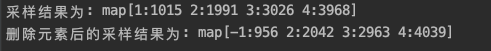

# go-alias
Alias Method algorithm written in Go.

# usage
```go
package main

import (
    "fmt"
    
    "gosample/alias"
)

type event struct {
    id   int
    prob float64
}

func (e *event) Id() int {
    return e.id
}

func (e *event) Prob() float64 {
    return e.prob
}

var (
    events = []alias.Event{
        &event{
            id:   1,
            prob: 0.1,
        },
        &event{
            id:   2,
            prob: 0.2,
        },
        &event{
            id:   3,
            prob: 0.3,
        },
        &event{
            id:   4,
            prob: 0.4,
        },
    }
)

func main() {
    draw := alias.New()
    err := draw.Add(events...)
    if err != nil {
        fmt.Println("add err: ", err)
        return
    }
    
    countInfo := make(map[int]int)
    for i := 1; i <= 10000; i++ {
        ok, id := draw.Pick()
        if !ok {
            // 如果添加的Event概率之和不为1，可能存在采样失败的情况
            fmt.Println("采样失败...")
            continue
        }
        countInfo[id] += 1
    }
    fmt.Printf("采样结果为: %v\n", countInfo)
    
    err = draw.Remove(&event{
        id:   1,
        prob: 0.1,
    })
    if err != nil {
        fmt.Println("remove err: ", err)
        return
    }
    countInfo = make(map[int]int)
    for i := 1; i <= 10000; i++ {
        ok, id := draw.Pick()
        if !ok {
            // 记采样失败的ID为-1
            countInfo[-1] += 1
        } else {
            countInfo[id] += 1
        }
    }
    fmt.Printf("删除元素后的采样结果为: %v\n", countInfo)
}
```

